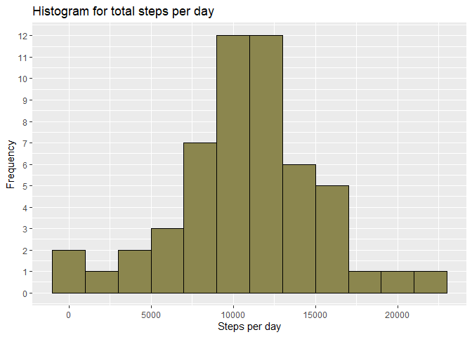
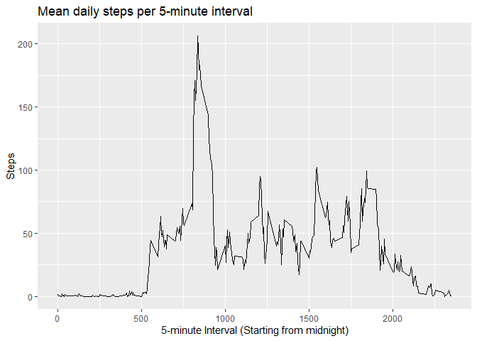
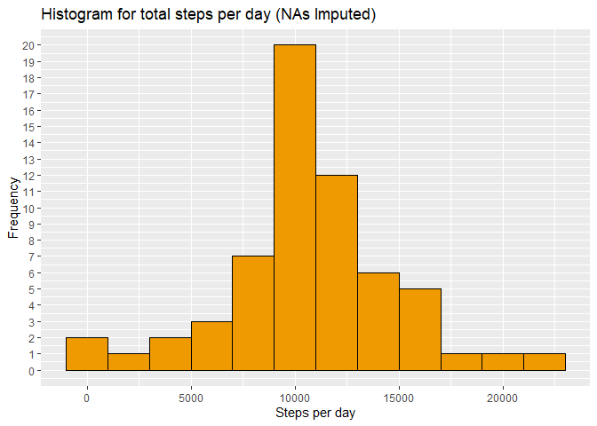
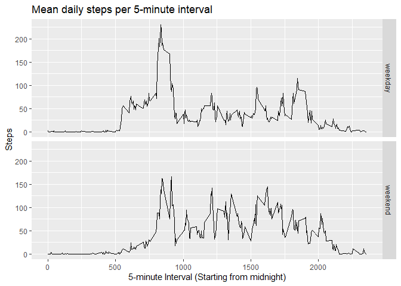

## Loading and preprocessing the data

This section loads the libraries, disables scientific notation for easier readability,
and loads in the required dataset.


```r
options(scipen = 999)
# Load the required libraries
library(ggplot2)
library(dplyr)
```

```
## 
## Attaching package: 'dplyr'
```

```
## The following objects are masked from 'package:stats':
## 
##     filter, lag
```

```
## The following objects are masked from 'package:base':
## 
##     intersect, setdiff, setequal, union
```

```r
library(lubridate)
```

```
## 
## Attaching package: 'lubridate'
```

```
## The following object is masked from 'package:base':
## 
##     date
```

```r
# Load the raw data and convert date to date-type
data <- read.table(unz("activity.zip", "activity.csv"), header = T, sep = ",")
data$date <- ymd(data$date)
```
  
  
## What is mean total number of steps taken per day?

From this section you can find the histogram of taken steps as well as mean and
median calculations for daily steps.


```r
# Group the data appropriately, ignore days with NA steps
StepsByDay <- data %>%
              group_by(date) %>%
              summarise(steps = sum(steps)) %>% 
              subset(!is.na(steps))

# Plot the histogram
ggplot(data = StepsByDay, aes(StepsByDay$steps)) +
  geom_histogram(binwidth = 2000,
                 col = "black",
                 fill = "khaki4") +
  labs(title = "Histogram for total steps per day") +
  labs(x = "Steps per day", y = "Frequency") +
  scale_y_continuous(breaks = 0:15)
```

<!-- -->

```r
# Calculate the mean and median of total number of steps taken per day
Mean <- round(mean(StepsByDay$steps), 0)

Median <- median(StepsByDay$steps)
```

The mean steps taken per day is **10766 steps** and the median steps taken per day is **10765 steps.**  


## What is the average daily activity pattern?

This sections illlustrates the daily steps taken by each 5-minute interval.

```r
# Group the data appropriately
MeanStepsByInterval <- data %>%
                       group_by(interval) %>%
                       summarise(steps = mean(steps, na.rm = T)) 

# Plot time-series
ggplot(data = MeanStepsByInterval, 
       aes(MeanStepsByInterval$interval, MeanStepsByInterval$steps)) +
       geom_line() +
       labs(title = "Mean daily steps per 5-minute interval") +
       labs(x = "5-minute Interval (Starting from midnight)", y = "Steps")
```

<!-- -->

```r
# Check the maximum interval by steps
maxsteps <- max(MeanStepsByInterval$steps)
Interval <- which(MeanStepsByInterval$steps == maxsteps)
IntervalStart <- (which(MeanStepsByInterval$steps == maxsteps)-1)*5
IntervalHours <- floor(IntervalStart/60)
IntervalMinutes <- IntervalStart %% 60
IntervalTime <- paste(IntervalHours, IntervalMinutes, sep = ".")
maxstepsround <- round(maxsteps, 0)
```

On average, the **104th** 5-minute interval starting from **8.35  **
includes the maximum number of steps which is **206 steps.**  
  

## Imputing missing values

In this section we fill in the missing values in data with the average of the corresponding 5-minute interval.  


```r
# Calculate the amount of NAs in the original data
NAs <- sum(is.na(data$steps))
NAportion <- round(NAs/nrow(data) * 100, 2)
```

All in all **13.11 percent** of the data is missing with their weight lying in night-time intervals.
  
  


```r
# Fill in NAs with the mean of the specified interval to a new dataframe
dataImputed <- data

for (i in 1:nrow(dataImputed)) {
    ifelse(is.na(dataImputed$steps[i]), 
           dataImputed$steps[i] <- MeanStepsByInterval$steps[which(MeanStepsByInterval$interval == data$interval[i])],
           dataImputed$steps[i] <- dataImputed$steps[i])
  }

# Group the imputed data appropriately,
StepsByDayImputed <- dataImputed %>%
              group_by(date) %>%
              summarise(steps = sum(steps)) %>% 
              subset(!is.na(steps))

# Plot the histogram
ggplot(data = StepsByDayImputed, aes(StepsByDayImputed$steps)) +
  geom_histogram(binwidth = 2000,
                 col = "black",
                 fill = "orange2") +
  labs(title = "Histogram for total steps per day (NAs Imputed)") +
  labs(x = "Steps per day", y = "Frequency") +
  scale_y_continuous(breaks = 0:20)
```

<!-- -->

```r
# Calculate the mean and median of total number of steps taken per day
MeanImputed <- round(mean(StepsByDayImputed$steps), 0)

MedianImputed <- round(median(StepsByDayImputed$steps), 0)
```

The NA-imputed mean steps taken per day is **10766 steps** and the NA-imputed median steps taken per day is **10766steps.  **
There is no significant impact to these figures by imputing the NAs with the 5-minute interval average.**  
  


## Are there differences in activity patterns between weekdays and weekends?

In this section we will compare if there are noticeable differences in activity patterns between weekdays and weekends.  
This is done by plotting the time-series of intervals for both layers separately.  


```r
# Create vector to identify observation between weekdays and weekenddays
suppressMessages(for (i in 1:nrow(dataImputed)) {
    ifelse(wday(dataImputed$date[i], week_start = 1) <= 5, 
           dataImputed$daytype[i] <- "weekday",
           dataImputed$daytype[i] <- "weekend"
           )})

dataImputed$daytype <- as.factor(dataImputed$daytype)

# Group the data appropriately
ImputedMeanStepsByInterval <- dataImputed %>%
                              group_by(interval, daytype) %>%
                              summarise(steps = mean(steps))

# Make a panel plot of time-series between weekdays and weekends
ggplot(data = ImputedMeanStepsByInterval, 
       aes(ImputedMeanStepsByInterval$interval, ImputedMeanStepsByInterval$steps)) +
       geom_line() +
       labs(title = "Mean daily steps per 5-minute interval") +
       labs(x = "5-minute Interval (Starting from midnight)", y = "Steps") +
       facet_grid(daytype ~ .)
```

<!-- -->

